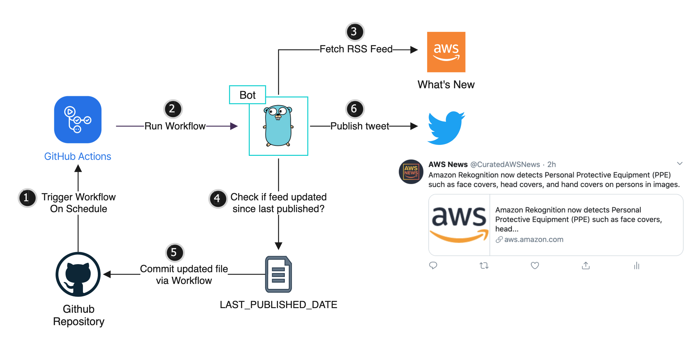

# aws-whats-new-bot
A bot to tweet _What's New at AWS_ from https://aws.amazon.com/new. Follow [@CuratedAWSNews](https://twitter.com/curatedawsnews) on Twitter.

# Build

### Set Twitter API as environment variables
```
$ export TWITTER_CONSUMER_KEY=
$ export TWITTER_CONSUMER_SECRET=
$ export TWITTER_ACCESS_TOKEN=
$ export TWITTER_ACCESS_TOKEN_SECRET=
```

### Install dependencies
```
$ make go-install
```

### Build binary
The binary will be stored in `bin/` directory
```
$ make go-build
```

### Run directly
```
$ make go-run
```

# Architecture


# Author
- [Puru Tuladhar](https://twitter.com/ptuladhar3)
